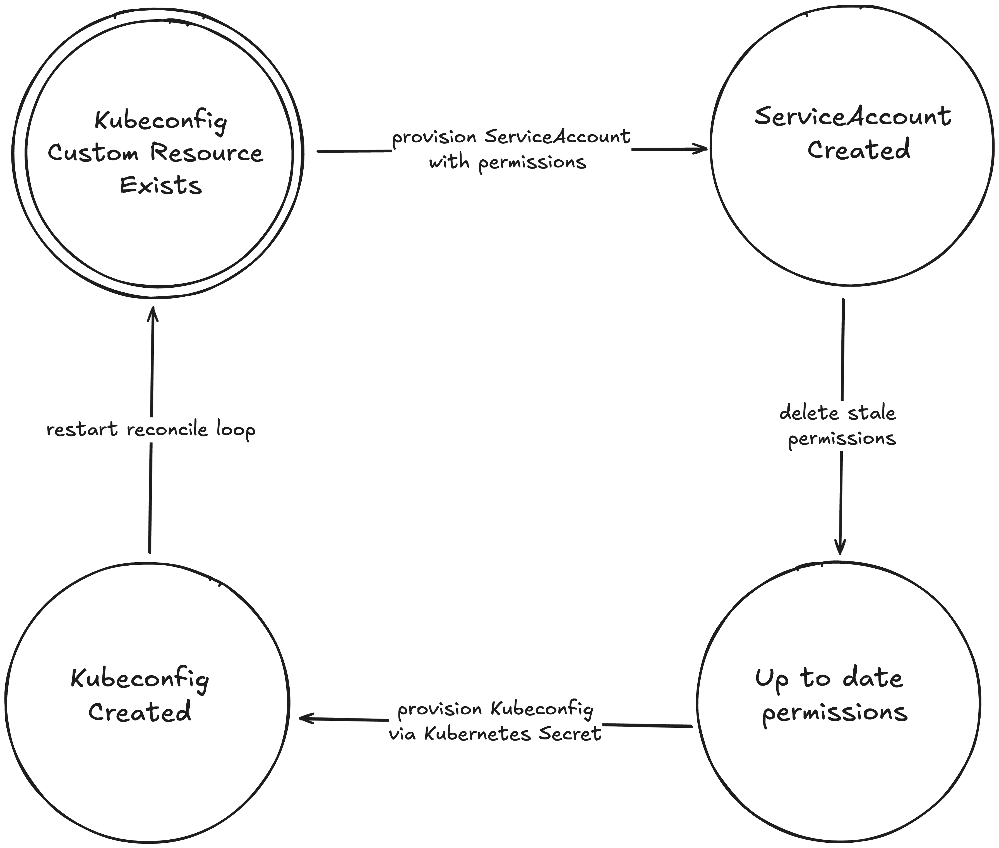

   

# Kubeconfig Operator

This controller implements a `Kubeconfig` custom resource to generate a kubeconfig file with a specified set of permissions.

The following example creates a kubeconfig limited to
- read access for namespaces
- read access for configmaps in namespace: kube-system
- read/write access for configmaps in namespace: default

## Quickstart

Install the newest version operator:

```bash
kubectl apply -k "github.com/klaudworks/kubeconfig-operator/manifests/base?ref=main"
```

Then, apply the following `Kubeconfig`:

```yaml
apiVersion: klaud.works/v1alpha1
kind: Kubeconfig
metadata:
  name: restricted-access
spec:
  clusterName: local-kind-cluster
  # specify external endpoint to your kubernetes API.
  # You can copy this from your other kubeconfig.
  server: https://127.0.0.1:52856   
  clusterPermissions:
    rules:
    - apiGroups:
      - ""
      resources:
      - namespaces
      verbs:
      - get
      - list
      - watch
  namespacedPermissions:
  - namespace: default
    rules:
    - apiGroups:
      - ""
      resources:
      - configmaps
      verbs:
      - '*'
  - namespace: kube-system
    rules:
    - apiGroups:
      - ""
      resources:
      - configmaps
      verbs:
      - get
      - list
      - watch
```

After applying the Kubeconfig custom resource, you can find the actual kubeconfig yaml in a secret `restricted-access-kubeconfig`. 

Extract and store the kubeconfig as follows:

```bash
kubectl get secret restricted-access-kubeconfig -o jsonpath="{.data.kubeconfig}" | base64 --decode > restricted-access-kubeconfig.yaml
```
## How the operator work?



## Use cases

- limit access for different users e.g. to a dev namespace
- protect yourself (and others) from accidentally performing destructive actions by using a restricted (e.g. readonly) Kubeconfig for day to day operations.

## Local Development


1. Clone the repository:
   ```
   git clone github.com:klaudworks/kubeconfig-operator.git
   ```
1. Ensure you install [kind](https://kind.sigs.k8s.io/docs/user/quick-start/#installation) or you have another Kubernetes distribution installed.
1. Install the CRDs 
   ```sh
   kubectl apply -f manifests/crd
   ```
1. Create the namespace for the controller
   ```sh
   kubectl create namespace kubeconfig-operator
   ```
1. Test the controller with the `Kubeconfig` yaml manifest from above.
1. Run the actual controller locally via:
   ```sh
   go run cmd/main.go --kubeconfig ~/.kube/kind.yaml --kubecontext kind-kind  
   ```
1. Download the kubeconfig
   ```sh
   kubectl get secret restricted-access-kubeconfig -o jsonpath="{.data.kubeconfig}" | base64 --decode
   ```

## Additional information

### Achilles SDK

This operator is based on [Achilles SDK](https://github.com/reddit/achilles-sdk) developed by reddit. It allows us to specify the operator's behavior as a finite state machine.

